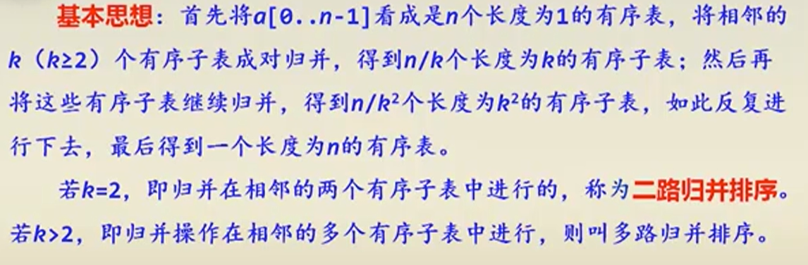

### 一、理论

#### 1.本章核心：分治

分治算法的核心就是：**分解子问题+求解子问题+把子问题合并**

* 分解子问题：不要想着完美的分解成两个子问题，你还要想着还有合并这个步骤，它们两个一起在宏观上想才能想到好办法。比如求解点集的最短子对，你想着分解成左右两个部分的子问题，分别求它们的最短子对，然后求出来了又有什么用呢？最短子对完全可以不在你的左边部分或右边部分，它可能跨过左右两部分啊！！？这时候就轮到合并出场了，它负责解决这个问题。

* 求解子问题：将子问题分解的足够小的时候，就可以用简单的办法解决。比如最短子对，就是分解到规模足够小时直接暴力求解。
* 合并：合并是很重要也是最困难的一步，它关系着怎么将求解好的子问题进行有效的合并。比如二路归并的合并就专门写了个合并的函数，把两个有序数组合并为一个有序数组。比如最短子对的合并就是以mid_point为主，做一个strip区，这个区内的点暴力求解出最短子对。你仔细琢磨会发现它们的合并算法都设计的很巧妙，不会遗漏任何情况。其实合并就是把两个或多个子问题合并起来成为一个更高一层的子问题。合并能不能合其实还取决于你的分解怎么分，你分的不好就合并不成功的，比如最短点对，你不按x坐标排序然后找个mid_point对半分解问题的话，其实根本就不会出现它巧妙的合并算法。

tips:

* 分解子问题和合并子问题是紧密相连的，而求解子问题则可以说是相对脱离的，你只需要能够把分解的足够小的问题求解出来（这也是递归出口），并且返回需要的值（比如最短点对就是求解子问题时返回子对和最小距离）就行了。
* 在分解子问题时要有整体思想，也就是说你要事先就认定你的子问题已经求解出来了，再去想其它的事，再去想怎么合并。具体怎么求解出来的，你先不用想，当你把合并解决了，自然就知道了。比如最短子对，我分成了左右两部分，我认定两个子问题都已经求解出来了，我解出来了左右两部分分别的最短子对，接下来怎么办吧！！！怎么才能合并两部分的解来得到我整体的解。这是整个解决问题时的整体宏观思想。


#### 2.快速排序（nlogn）


#### 3.归并排序(nlogn)



##### 1)自底向上（非递归实现）

一开始就着眼于底部，把每一个数字视为一个有序子序列，然后两两合并，一步一步合并到顶层。


##### 2）自顶向下（递归实现）

从顶部用大局观来分解问题，一次分一半，分解的过程是从顶向下，但是合并其实还是从递归底部进行的。


这两种方法都是需要认真思考合并的算法实现的，主要是要考虑到有子序列配不了对要轮空，这个需要你考虑全面。

*********

### 二、实践

#### 1.最近子对问题

[code](./task/task.py)


```python
####把核心的分治代码贴于此，认真体会一下

def closest_pair(points_x, points_y, depth=0):
    # 如果点数量小于等于3，使用暴力法计算最近点对
    if len(points_x) <= 3:
        return brute_force(points_x)
    
    # 找到中间位置
    mid = len(points_x) // 2
    mid_point = points_x[mid]
    
    left_points_x = points_x[:mid]
    right_points_x = points_x[mid:]
    
    left_points_y = list(filter(lambda p: p.x <= mid_point.x, points_y))
    right_points_y = list(filter(lambda p: p.x > mid_point.x, points_y))
    
    
    
    # 递归计算左右两边的最近点对
    (p1, p2), d1 = closest_pair(left_points_x, left_points_y, depth + 1)
    (p3, p4), d2 = closest_pair(right_points_x, right_points_y, depth + 1)
    
    
    
    # 取左右两边最小距离的最近点对
    if d1 < d2:
        closest_pair1 = (p1, p2)
        min_distance = d1
    else:
        closest_pair1 = (p3, p4)
        min_distance = d2
    
    # 绘制当前递归层次下的点集和最近点对
    plot_points(points_x, closest_pair1, depth)
    
    # 构造中间带宽区域的点
    strip = [p for p in points_y if abs(p.x - mid_point.x) < min_distance]
    
    # 检查中间带宽区域的最近点对
    for i in range(len(strip)):
        for j in range(i + 1, len(strip)):
            if (strip[j].y - strip[i].y) < min_distance:
                distance = euclidean_distance(strip[i], strip[j])
                if distance < min_distance:
                    min_distance = distance
                    closest_pair1 = (strip[i], strip[j])
                    
    return closest_pair1, min_distance
```

思考与心得：

```
1）分解：我将所有的点先按着x坐标从小到大排序，然后从中间一分两半，这样就能得到两个子问题。

2）求解子问题：当子问题的点的个数<=3时，我就直接暴力求解出最近点对，然后把最近点对和局部最小距离min_distance return回；其余情况下，我就继续分解成两部分递归下去。

3）合并：现在我得到了左右两个部分的最近点对，我怎么得到这个整体的最近点对呢？因为我是将点集按照x坐标排序的，所以我需要检测中线边缘的点，在距离中间点 mid_point 的横坐标不超过 min_distance 的区域中找点(如果水平距离都比现有的最小距离要大，那就不可能有更小的点对距离！！！)。
```

```
分治在用到递归的时候，你别在那一直想递归三步骤，分解，求解，合并。你也想想递归的要义啊，那就是找好递归终结条件。🌟今天的算法第二次作业题出的真的很好，我终于理解了这个最小距离点对的经典问题如何用分治法求解！
1.先把所有点按x坐标从小到大排序，然后取个中间点把所有点一分为二，直接就把问题分成两个问题（先排序再分其实很关键，如果你瞎分就会导致你无法合并），即分别求左半部分和右半部分的最小点对。
2.子问题的求解就比较好理解了，点的数量如果小于4个，我就直接暴力把最小点对求出来（这也是我们整个递归的出口），其他情况就继续分，一直递归下去。
3.这个合并可以说是本题最精髓的部分了，当我们得到了左右两部分的两组最小点对后，我们如何合并？精彩的来了！！！
先把两部分的最小点对的min_distance 对比，找到最小的一个。然后！以中心点mid_point为中心，向左右各延伸min_distance的距离，在这些范围内的点全部用暴力法求一下有没有比当前min_distance小的，有点话就更新，没有就保持，然后把最小点对return出来，继续别的递归了。（现在我得到了左右两个部分的最近点对，我怎么得到这个整体的最近点对呢？因为我是将点集按照x坐标排序的，所以我需要检测中线边缘的点，在距离中间点 mid_point 的横坐标不超过 min_distance 的区域中找点(如果水平距离都比现有的最小距离要大，那就不可能有更小的点对距离！！！)）
```


接下来我以20个随机的平面点为例，将具体的流程演示一下：

1)生成的随机点画成的图像：

 

 

2）递归进行过程中各个节点的生成图像如下，我在递归函数closest_pair中是先递归，再画图，所以画出的第一张图是最底层，而Deepth0则是最后画出，因为我一共生成了20个点，当点数小于等于3时就结束递归，所以一共有三层深度。自底向上的图像分治结构为(**红与绿代表当前的最小点对**)：

 

 

 

 

 

 

 

 

Deepth0图像的红绿点对就是全局的最小点对！


#### 2.二路归并排序的自底向上实现

[code](./2.Mergesort/Mergesort_down2up.cpp)

* Merge函数，这个是最基础最底层的合并方式，思路就是新建一个数组tmp，然后两个“指针”i和j指向要合并的两个有序数组的开头，谁的值小谁就赋值给tmp,然后指针后移，直到一个数组先遍历完，最后把没遍历完的数组直接接在tmp后面。
* 函数设计其实是先设计Mergesort，里面用到了其它函数，但是函数我并没有实现，然后再设计MergeOnce的细节，最后设计的Merge的细节。

```c++
void Merge(int *a,int start,int mid,int end)//1.这个是最基础最底层的合并方式，思路就是新建一个数组tmp，然后两个“指针”i和j指向要合并的两个有序数组的开头，谁的值小谁就赋值给tmp,然后指针后移，直到一个数组先遍历完，最后把没遍历完的数组直接接在tmp后面。注意mid这个参数不是多余，它是为了应对异常情况的。
{
    int * tmp = (int *)malloc(sizeof(int)*(end-start+1));
    int tmp_index = 0;

    int i = start,j = mid;

    while( (i<=mid - 1)&&(j<=end) )//2.注意这个循环条件的写法，很妙的
    {
        if(a[i]<=a[j]){tmp[tmp_index]=a[i];tmp_index++;i++;}
        if(a[i]>a[j]){tmp[tmp_index]=a[j];tmp_index++;j++;} 
    }

    while(i!=mid){tmp[tmp_index] = a[i];tmp_index++;i++;}
    while(j!=end+1){tmp[tmp_index] = a[j];tmp_index++;j++;}

    int t = 0;
    for(int e = start;e<=end;e++) {a[e] = tmp[t];t++;} //3.这里可别直接把e等于0了，你要有分治的概念，我们在一个数组里面通过start,end来划分出虚拟的不同数组，但其实所有操作都在一个数组里面。

    free(tmp);
    
}


void MergeOnce(int *a,int length,int nums)
{
    int i;
    for( i = 0; i+2*length<=nums; i+=2*length)
    {
        Merge(a,i,i+length,i+2*length-1);
    }
    if(i+length <= nums-1)//4.这个就是没有办法配成一对的情况，你也得排序，这就体现出Merge()函数的mid参数的重要性了，就是为了应对这种情况，它可不是多余。
        Merge(a,i,i+length,nums-1);
}

void Mergesort(int *a,int nums)
{
    
    for(int length = 1;length<=nums; length*=2)
    {
        MergeOnce(a,length,nums);
    }
}
```

确定函数接口很重要,比如：

* Merge:给我一个数组a，给我start,mid,end的值，我可以把a[start]~a[mid-1]与a[mid]~a[end]这个有序数组的数进行排序，即可以使a[start]~a[end]成为一个有序数组。
* MergeOnce:给我一个数组a，子序列长度length，数组长度nums。我可以以length为一个子序列长度单位把子序列两两合并。
* Mergesort就是给我个数组，我给你排序。

Mergesort就是搞个for循环，先把length为1的子序列进行两两合并，得到两个数为一组的n个有序子序列，然后length变为2，合并得到四个数为一组的n个有序子序列，慢慢的全部。

#### 3.二路归并的自顶向下实现

[code](./2.Mergesort/Mergesort_up2down.cpp)

这个就比较好理解了，使用递归的方法来写思路很清晰，Merge是具体的合并函数，你已经非常熟悉了，而真正的逻辑实现就是在上层函数Mergesort中实现的。注意的就是别忘了写递归出口，否则真不知道怎么结束。

还有就是你之前写的错误代码：int mid = (end -start)/2; 这个真的很容易掉到坑里面！！！时刻记住你不是从0开始的，你是从start开始的，(end -start)/2只是个偏移量啊啊啊啊啊。

```c++
void Merge(int *a,int start,int mid,int end)//跟2的函数是同一个
{
    int *tmp = (int *)malloc(sizeof(int)*(end-start+1));
    int tmp_n = 0;
    int i = start,j = mid +1;

    while(i<=mid&&j<=end)
    {
        if(a[i]<=a[j]){tmp[tmp_n] = a[i];tmp_n++;i++;}
        else{tmp[tmp_n] = a[j];tmp_n++;j++;}
    }

    
    while(i!=mid+1){tmp[tmp_n] =  a[i]; tmp_n++; i++;}
    while(j!=end+1){tmp[tmp_n] = a[j]; tmp_n++; j++;}

    tmp_n = 0;
    for(int k = start;k<=end; k++){a[k] = tmp[tmp_n];tmp_n++;}

    free(tmp);
}

void Mergesort(int *a,int start,int end)
{
	//求解子问题
    if(end - start <=1) 
    {
        if(a[start] > a[end]) {int t = a[start];a[start]=a[end];a[end]=t;}
    
        return;
    }
	//分解子问题
    int mid = (end -start)/2 + start;

    Mergesort(a,start,mid);
    Mergesort(a,mid+1,end);
	//子问题合并
    Merge(a,start,mid,end); 
}

```


